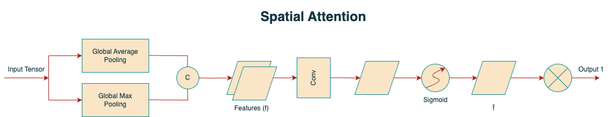
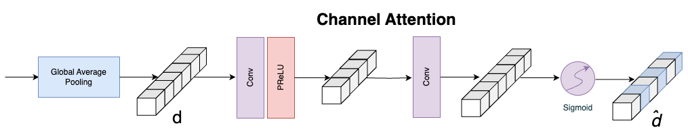
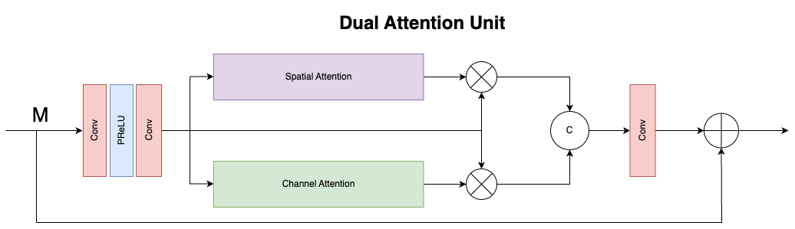
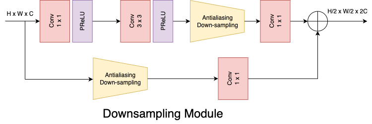
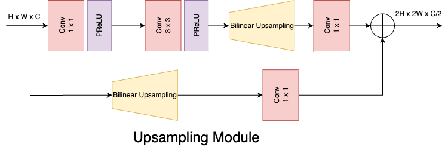

# Low Light Enhancement of Images using MIRNet

This repository contains code for performing low light image enhancement using the MiRNet (Minimum Information Restoration Network) deep learning model. MiRNet is a state-of-the-art neural network architecture designed specifically for enhancing low light images while preserving important details and minimizing noise.

## Table of Contents

 - [Introduction](#introduction)
 - [Dataset](#dataset)
 - [Installation](#installation)
 - [Dual Attention Module](#dual-attention-module)
 - [Contributions](#contributions)
 - [License](#license)

## Introduction

Image restoration has several uses in fields like photography, security, medical imaging, and remote sensing with the objective of recovering high-quality image content from its degraded version. The MIRNet model, a fully convolutional architecture that learns an enriched set of features that incorporates contextual information from many scales, is used by us to improve low-light images while simultaneously keeping the high-resolution spatial details.

## Dataset

The LoL Dataset has been created for low-light image enhancement. It provides 485 images for training and 15 for testing. Each image pair in the dataset consists of a low-light input image and its corresponding well-exposed reference image.

You can download the dataset from [here](https://www.kaggle.com/datasets/arnabkumarroy02/lol-dataset/data).

## Installation

To use the code in this repository:

Clone the repository:

```shell
https://github.com/ArnabKumarRoy02/Low-light-enhancement.git
```

## Dual Attention Module

The Dual Attention Unit or DAU is used to extract features in the convolutional streams. While the SKFF block fuses information across multi-resolution branches, we also need a mechanism to share information within a feature tensor, both along the spatial and the channel dimensions which is done by the DAU block. The DAU suppresses less useful features and only allows more informative ones to pass further. This feature recalibration is achieved by using Channel Attention and Spatial Attention mechanisms.

<div align="center">
  
  <p>Fig: Spatial Attention from Dual Attention Unit</p>
  <br>
</div>

<div align="center">
  
  <p>Fig: Channel Attention from Dual Attention Unit</p>
  <br>
</div>

<div align="center">
	
	<p>Fig: Dual Attention Module</p>
	<br>
</div>

Downsampling Module            |  Upsampling Module
:-------------------------:|:-------------------------:
  |  

## Contributions

Contributions to this project are welcome! If you have any suggestions, bug reports, or would like to contribute improvements, please submit a pull request or open an issue.

## License

This project is licensed under the MIT License. See the [LICENSE](LICENSE) file for more details.
